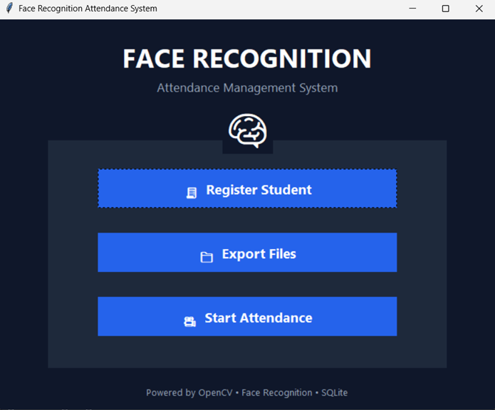
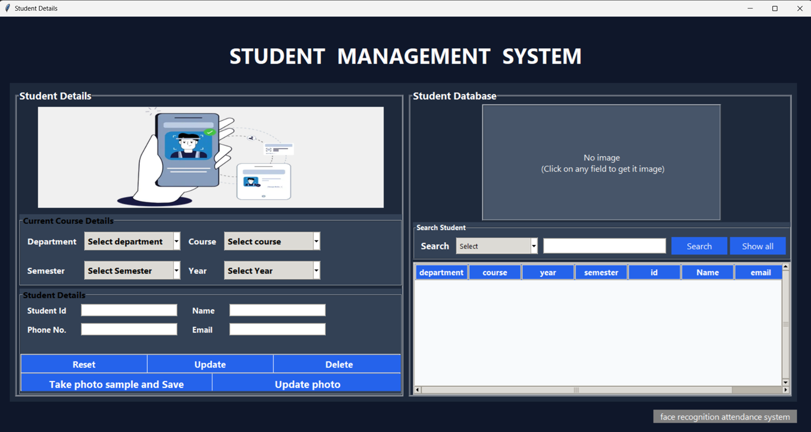
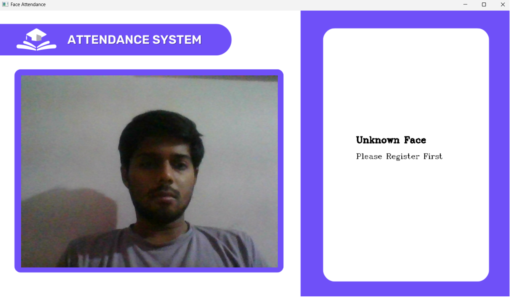
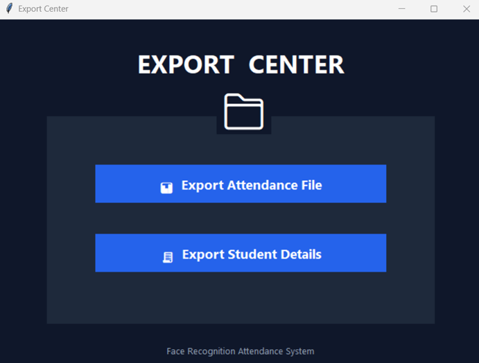

# 🎓 Face Recognition Attendance System


A fully working desktop-based automated attendance system that uses
real-time face recognition through a webcam. No manual entry needed —
the system detects and identifies students automatically and marks
their attendance with date and time in a local database.

---

## 💾 Download & Run (No Python needed):

> [Download FaceAttendanceSystem.exe](https://github.com/YOURUSERNAME/face-recognition-attendance-system/releases/tag/v1.0)

---

## 📽️ Demo


Main Menu window:


Registration Window:


Attendance Window:


Exporting File Window:


---

## ✨ Features

- 🎥 Real-time face detection and recognition via webcam
- 🧾 Student registration with live photo capture
- ✅ Automatic attendance marking with date and time
- 🔍 Search and filter students by name, ID, department, and more
- 📊 Export attendance records and student data as CSV
- 🗃️ Fully local — no internet required after setup
- 🧹 Clean modular codebase split across focused modules

---

## 🛠️ Tech Stack

|        Layer      | Technology                                |
|-------------------|-------------------------------------------|
| Language          | Python 3.10                               |
| Face Recognition  | face_recognition library (dlib CNN model) |
| Computer Vision   | OpenCV                                    |
| GUI               | Tkinter                                   |
| Database          | SQLite3                                   |
| Image Processing  | Pillow                                    |
| UI Utilities      | cvzone                                    |
| Packaging         | PyInstaller                               |

---

## 🗂️ Project Structure

Face Recognition Attendance System/
      ├── main.py                  # Main launcher and navigation hub
      ├── give_details.py          # Student registration, CRUD operations
      ├── attendance_btn.py        # Face recognition engine (threaded)
      ├── export_files.py          # CSV export for attendance and students
      ├── banner.png               # UI banner image
      ├── app_config.json          # Auto-generated: stores image folder path
      ├── attendance.db            # Auto-generated: SQLite database
      ├── EncodeFile.p             # Auto-generated: face encodings cache
      └── Resources/
            ├── background.png     # Attendance window background
            └── Modes/
                  ├── 1.png        # Idle mode overlay
                  ├── 2.png        # Loading mode overlay
                  ├── 3.png        # Already marked overlay
                  └── 4.png        # Success mode overlay

---

## ⚙️ How It Works

Student registers → Photo captured → Face encoded → Saved to DB
                │
                ▼
Attendance session starts → Webcam reads frames → Face detected
                │
                ▼
Matched against saved encodings
                │
    ┌───────────┴───────────┐
Match found             No match
    │                       │
Attendance marked     "Unknown Face"
in SQLite with        shown on screen
date and time

---

## 🚀 How to Run (Developer Setup)

### Requirements
- Windows 10 or 11 (64-bit)
- Python 3.10 exactly
- Working webcam
- Visual C++ Build Tools (needed for dlib)

### Step 1 — Install Visual C++ Build Tools
Download from:
https://visualstudio.microsoft.com/visual-cpp-build-tools/
Select **Desktop development with C++** and install.

### Step 2 — Install CMake
Download from: https://cmake.org/download/
During install select **Add CMake to PATH**.

### Step 3 — Clone and setup

```bash
git clone https://github.com/somil404/face-recognition-attendance-system.git   ← CHANGE THIS
cd face-recognition-attendance-system
python -m venv venv
venv\Scripts\activate
```

### Step 4 — Install dependencies

```bash
pip install opencv-python
pip install opencv-contrib-python
pip install Pillow
pip install cvzone
pip install cmake
pip install dlib
pip install face_recognition
```

### Step 5 — Run

```bash
python main.py
```

---

## 💻 How to Run (No Python — Windows .exe)

1. Go to [Releases](https://github.com/somil404/face-recognition-attendance-system/releases)   ← CHANGE THIS
2. Download `FaceAttendanceSystem.exe`
3. Double-click to run — no installation needed

**Requirements for .exe:** Windows 10/11, webcam, 4GB RAM

---

## 📖 Usage Guide

**Register a student:**
1. Click **Register Student**
2. Fill in all fields (Department, Course, Year, Semester, ID, Name, Email, Phone)
3. Click **Take photo sample and Save**
4. Camera opens — press `s` to capture, `q` to cancel

**Mark attendance:**
1. Click **Start Attendance**
2. Webcam window opens — registered faces are detected automatically
3. Attendance is saved with current date and time
4. Press `q` or click **Stop Attendance** to end

**Export data:**
1. Click **Export Files**
2. Choose **Export Attendance** or **Export Student Details**
3. Choose save location — file saves as `.csv`

---

## 🔒 Data and Privacy

- All data is stored **locally** on the device running the application
- No data is sent to any server or cloud service
- Face encodings are stored as numerical vectors, not raw images
- Internet connection is **not required** for any feature

---

## 📋 Requirements Summary

python==3.10
opencv-python
opencv-contrib-python
Pillow
cvzone
cmake
dlib
face_recognition

---

## 🙋‍♂️ Author

**Somil Agrawal**
[GitHub](https://github.com/somil404) · [LinkedIn](https://linkedin.com/in/somil-agrawal-8218a0333)
